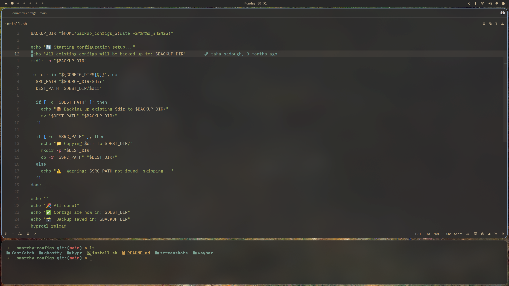

# Hyprland Configurations

This repo contains customizations for your Omarchy - Hyprland environment, including animation settings, border color adjustments, rounding changes, and keybindings for workspace management and window resizing. These settings are intended to enhance the look and feel of your Hyprland session.



# install:

```sh
  chmod +x install.sh && ./install.sh
```

## Animations

The following animation settings control the appearance and transitions within the workspace.

```ini
animations {
    enabled = yes
    bezier = softEase, 0.34, 0.0, 0.0, 1.2
    animation = workspaces, 1, 5, softEase, slide
    animation = fade, 1, 8, softEase
    animation = border, 1, 5, softEase
    animation = borderangle, 1, 12, softEase
}
```

- **`enabled = yes`**: Enables the animations globally.
- **`bezier = softEase, 0.34, 0.0, 0.0, 1.2`**: Defines a custom Bezier curve for easing the animations. This makes transitions smoother.
- **`animation = workspaces, 1, 5, softEase, slide`**: Animates workspace switches with a soft easing and a slide effect.
- **`animation = fade, 1, 8, softEase`**: Applies a fade effect during transitions with a soft easing curve.
- **`animation = border, 1, 5, softEase`**: Adds animation to window borders with a soft ease.
- **`animation = borderangle, 1, 12, softEase`**: Smoothly animates changes in the window border's angle.

## Border Customization

To create a lighter border with a rounded appearance, modify the following:

```ini
col.active_border = rgb(81a1c1)
```

This color code `rgb(81a1c1)` provides a light blue border for active windows. The visual effect is enhanced with more rounding compared to the default "Omarchy" theme for a smoother, softer look.

## Keybindings

These keybindings provide quick access to applications, system tools, web apps, and window/workspace management in your Hyprland setup. They are defined using variables for common commands (e.g., `$terminal`, `$browser`) to make the configuration more modular and easier to maintain. Keybindings use modifiers like `SUPER` (Windows key), `CTRL`, `ALT`, and `SHIFT`, combined with specific keys.

```ini
$terminal = uwsm-app -- xdg-terminal-exec
$browser = omarchy-launch-browser
$file_manager = nautilus

bindd = SUPER, RETURN, Terminal, exec, $terminal --working-directory="$(omarchy-cmd-terminal-cwd)"
bindd = CTRL ALT, P, Browser (private), exec, $browser --private
bindd = SUPER SHIFT, B, Browser, exec, $browser
bindd = SUPER SHIFT, F, Files,exec,$file_manager
bindd = SUPER SHIFT ALT, B, Browser (private), exec, $browser --private
bindd = SUPER SHIFT, M, Music, exec, omarchy-launch-or-focus spotify
bindd = SUPER SHIFT, N, Editor, exec, omarchy-launch-editor
bindd = SUPER SHIFT, T, Activity, exec, $terminal -e btop
bindd = SUPER SHIFT, D, Docker, exec, $terminal -e lazydocker
bindd = SUPER SHIFT, G, Signal, exec, omarchy-launch-or-focus signal "uwsm-app -- signal-desktop"
bindd = SUPER SHIFT, O, Obsidian, exec, omarchy-launch-or-focus "^obsidian$" "uwsm-app -- obsidian -disable-gpu --enable-wayland-ime"
bindd = SUPER SHIFT, W, Typora, exec, uwsm-app -- typora --enable-wayland-ime
bindd = SUPER SHIFT, SLASH, Passwords, exec, uwsm-app -- 1password

# If your web app url contains #, type it as ## to prevent hyprland treating it as a comment
# bindd = SUPER SHIFT ALT, A, ChatGPT, exec, omarchy-launch-webapp "https://chatgpt.com"
bindd = SUPER SHIFT , A, Grok, exec, omarchy-launch-webapp "https://grok.com"
bindd = SUPER SHIFT, C, Calendar, exec, omarchy-launch-webapp "https://app.hey.com/calendar/weeks/"
bindd = SUPER SHIFT, E, Email, exec, omarchy-launch-webapp "https://app.hey.com"
bindd = SUPER SHIFT, Y, YouTube, exec, omarchy-launch-webapp "https://youtube.com/"
bindd = SUPER SHIFT ALT, G, WhatsApp, exec, omarchy-launch-or-focus-webapp WhatsApp "https://web.whatsapp.com/"
bindd = SUPER SHIFT CTRL, G, Google Messages, exec, omarchy-launch-or-focus-webapp "Google Messages" "https://messages.google.com/web/conversations"
bindd = SUPER SHIFT, P, Google Photos, exec, omarchy-launch-or-focus-webapp "Google Photos" "https://photos.google.com/"
bindd = SUPER SHIFT, X, X, exec, omarchy-launch-webapp "https://x.com/"
bindd = SUPER SHIFT ALT, X, X Post, exec, omarchy-launch-webapp "https://x.com/compose/post"
bindd = CTRL SUPER, left,Pervious workspace ,workspace, -1
bindd = CTRL SUPER, right,Next workspace, workspace, +1
bindd = SUPER ALT, left,Resize window left ,resizeactive, -50 0
bindd = SUPER ALT, right, Resize window right,resizeactive, 50 0
bindd = SUPER ALT, up, Resize window up,resizeactive, 0 -50
bindd = SUPER ALT, down, Resize window down,resizeactive, 0 50
bindd = SUPER_CTRL_SHIFT, left,Move window to pervious workspace ,movetoworkspace, -1
bindd = SUPER_CTRL_SHIFT, right,Move window to next workspace ,movetoworkspace, +1
bindd = SUPER_CTRL_SHIFT, up, Move window to pervious workspace ,movetoworkspace, -1
bindd = SUPER_CTRL_SHIFT, down,Move window to next workspace ,movetoworkspace, +1
bindd = SUPER,L,Lock Screen,exec,omarchy-lock-screen

unbind = SUPER, SPACE
bindd = SUPER, SPACE, Omarchy menu, exec, omarchy-menu
```

## Idle and Lock Settings

These settings configure general behavior for locking, sleep inhibition, and idle timeouts using listeners. They help manage screen locking, screensavers, and power-saving features automatically based on inactivity periods. This is useful for security (locking the session) and energy efficiency (turning off the display).

```ini
general {
    lock_cmd = omarchy-lock-screen
    before_sleep_cmd = loginctl lock-session
    after_sleep_cmd = hyprctl dispatch dpms on
    inhibit_sleep = 3
}

# 1 Min → start screensaver
listener {
    timeout = 60
    on-timeout = pidof hyprlock || omarchy-launch-screensaver
}

# 2 min → lock the screen
listener {
    timeout = 120
    on-timeout =  loginctl lock-session
}

# 5 sec → turn off screen *only if locked*
listener {
    timeout = 5
on-timeout = pidof hyprlock && \
                 hyprctl dispatch dpms off && brightnessctl -d
    on-resume = hyprctl dispatch dpms on && brightnessctl -r
}

```

### General Section

- **`lock_cmd = omarchy-lock-screen`**: Specifies the command to run when locking the screen, using a custom Omarchy lock screen utility.
- **`before_sleep_cmd = loginctl lock-session`**: Runs this command before the system enters sleep mode, ensuring the session is locked for security.
- **`after_sleep_cmd = hyprctl dispatch dpms on`**: Executes after waking from sleep to turn the display back on using Hyprland's DPMS (Display Power Management Signaling) control.
- **`inhibit_sleep = 3`**: Sets the sleep inhibition level (likely a custom or Hyprland-specific value; 3 might correspond to inhibiting sleep under certain conditions like active fullscreen apps or media playback).

### Listener Sections

Listeners monitor for inactivity timeouts and trigger actions accordingly. These are configured for progressive idle management:

- **30-second listener**: Starts the screensaver if the system is idle for 30 seconds. The command `pidof hyprlock || omarchy-launch-screensaver` checks if Hyprlock (a locking tool) is already running; if not, it launches the custom Omarchy screensaver.
- **60-second listener**: Locks the entire session after 60 seconds of inactivity using `loginctl lock-session`.
- **5-second listener**: Turns off the screen (via DPMS) only if the session is already locked (checked with `pidof hyprlock`). On resume (when activity is detected), it turns the display back on and restores brightness settings with `brightnessctl -r`. This ensures the display powers down quickly for energy savings but only when the system is securely locked.
