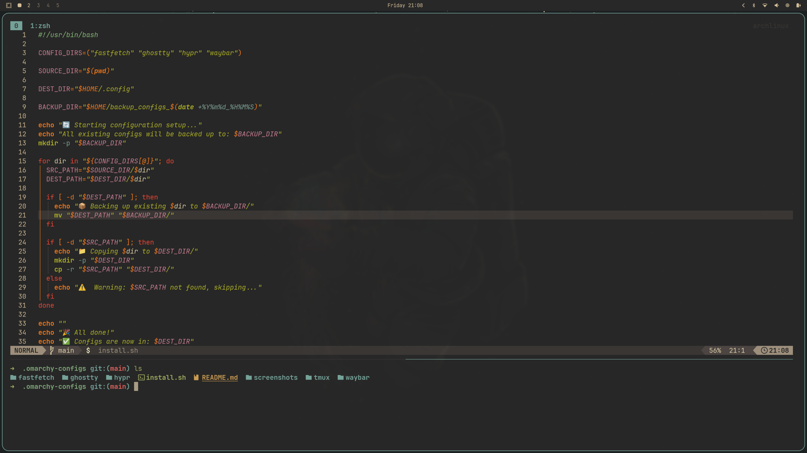

# 🌌 Omarchy Hyprland Config

A highly customized, animated, and productivity-focused configuration for the **Omarchy - Hyprland** environment. This setup features bouncy "overshot" animations, soft rounded aesthetics, robust window management, and a suite of productivity keybindings.




## 🚀 Installation

Apply the configurations by running the installation script:

```sh
chmod +x install.sh && ./install.sh
```

---

## ⌨️ Input & Region Setup

**⚠️ Important:** Before using this configuration, you must adjust the keyboard layout to match your region.

The default configuration includes `us` and `ir` layouts. Edit the `input` section in your config file to replace `ir` with your specific country code (e.g., `de`, `fr`, `es`).

```ini
input {
    # REPLACE 'ir' WITH YOUR LANGUAGE CODE BELOW
    kb_layout = us,ir
    kb_options = compose:caps
    kb_options = grp:alt_shift_toggle

    repeat_rate = 40
    repeat_delay = 200
    numlock_by_default = true

    touchpad {
        scroll_factor = 0.4
    }
}
```

> **Note:** Specific scroll sensitivity adjustments are applied for terminal emulators:
>
> - **Fast Scroll (1.5):** Alacritty, Kitty
> - **Slow Scroll (0.2):** Ghostty

---

## ✨ Look, Feel & Animations

This configuration moves away from standard linear transitions to a more dynamic, fluid experience using custom Bezier curves.

### 🎨 Aesthetics

- **Borders:** Thin (`1px`), colored in **Nord Blue** (`rgb(81a1c1)`).
- **Rounding:** Soft corner radius of `12px`.
- **Opacity:** Active windows are slightly transparent (`0.95`), while inactive windows dim further (`0.90`).
  - _Browsers (Chrome, Firefox, Brave, etc.) are forced to be fully opaque and unblurred for text clarity._

### 🎬 Animation Engine

We use **Overshot** and **Spring** physics for a responsive feel.

- **Windows:** Open with a "pop-in" effect and a strong overshot bounce.
- **Workspaces:** Slide smoothly with momentum.
- **Border Angle:** A looping animation rotates the border gradient for a subtle visual flair.

<!-- end list -->

```ini
animations {
    enabled = yes
    bezier = strongOvershot, 0.05, 0.9, 0.1, 1.12
    animation = windowsIn, 1, 3, strongOvershot, popin 82%
    animation = workspaces, 1, 6, workspace, slide
}
```

---

## 📊 Modern Status Bar (Waybar)

The Waybar configuration has been overhauled to feature a **clean, floating aesthetic**.

- **Design:** Replaces the traditional solid bar with distinct, floating modules.
- **Cohesion:** Features consistent rounding and spacing to perfectly align with the Hyprland window geometry.

---

## 🎹 Keybindings

Variables used: `$terminal` (xdg-terminal), `$browser` (omarchy-launch-browser), `$file_manager` (nautilus).

### System & Window Management

| Key Combination       | Action                      |
| :-------------------- | :-------------------------- |
| **SUPER + RETURN**    | Open Terminal (Current CWD) |
| **SUPER + SHIFT + F** | Open File Manager           |
| **SUPER + L**         | Lock Screen                 |
| **SUPER + SHIFT + W** | **Toggle Motion Wallpaper** |
| **SUPER + B**         | **Toggle Opacity & Blur**   |
| **SUPER + SHIFT + I** | **Toggle hypridle**         |

### Navigation & Resizing

| Key Combination                   | Action                   |
| :-------------------------------- | :----------------------- |
| **CTRL + SUPER + ← / →**          | Switch Workspace         |
| **SUPER + CTRL + SHIFT + Arrows** | Move Window to Workspace |
| **SUPER + ALT + Arrows**          | Resize Active Window     |

### Productivity & Apps

| Key Combination             | Action                        |
| :-------------------------- | :---------------------------- |
| **SUPER + SHIFT + B**       | Browser                       |
| **CTRL + ALT + P**          | Private Browser               |
| **SUPER + SHIFT + ALT + B** | Private Browser (Alternate)   |
| **SUPER + SHIFT + N**       | Editor                        |
| **SUPER + SHIFT + T**       | Activity Monitor (`btop`)     |
| **SUPER + SHIFT + D**       | Docker Manager (`lazydocker`) |
| **SUPER + SHIFT + SLASH**   | 1Password                     |
| **SUPER + SHIFT + M**       | Spotify                       |
| **SUPER + SHIFT + O**       | Obsidian                      |
| **SUPER + SHIFT + W**       | Typora                        |

### Web Apps & AI

| Key Combination              | Action           |
| :--------------------------- | :--------------- |
| **SUPER + SHIFT + A**        | **Grok**         |
| **SUPER + SHIFT + G**        | **Gemini**       |
| **SUPER + SHIFT + E**        | Hey Email        |
| **SUPER + SHIFT + C**        | Hey Calendar     |
| **SUPER + SHIFT + Y**        | YouTube          |
| **SUPER + SHIFT + P**        | Google Photos    |
| **SUPER + SHIFT + X**        | X (Twitter)      |
| **SUPER + SHIFT + ALT + X**  | X (Compose Post) |
| **SUPER + SHIFT + ALT + G**  | WhatsApp         |
| **SUPER + SHIFT + CTRL + G** | Google Messages  |

---

## 🛡️ Idle & Power Management

The system uses `hypridle` to manage energy efficiency and security automatically.

1.  **1 Minute:** Only if Hyprlock isn't running, start the **Screensaver**.
2.  **2 Minutes:** **Lock the session** securely.
3.  **Locked + 5 Seconds:** Turn **Screen OFF** to save battery.
    - _On Resume:_ Screen turns on and brightness is restored.
4.  **Sleep/Suspend:** System locks automatically before entering sleep.

<!-- end list -->

```ini
listener {
    timeout = 60
    on-timeout = pidof hyprlock || omarchy-launch-screensaver
}
```
